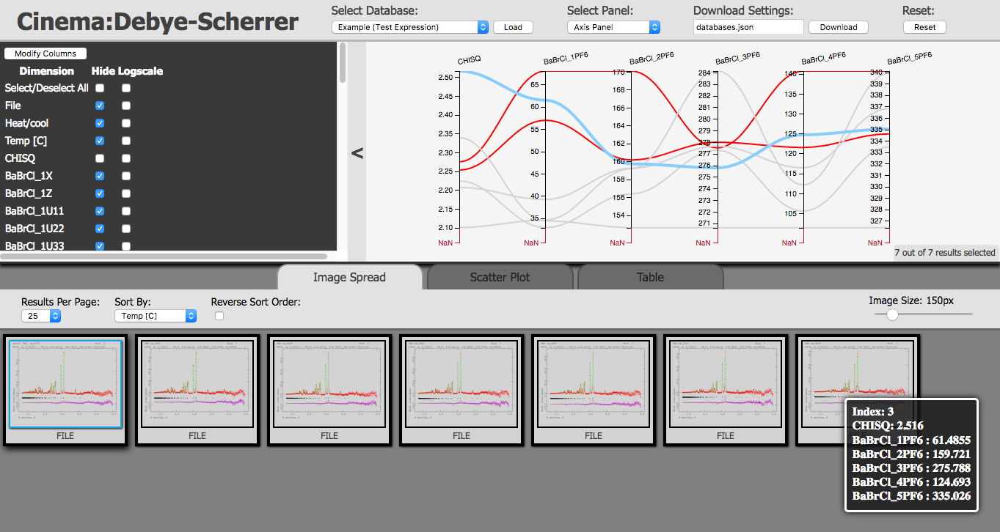

# Cinema:Debye-Scherrer

Cinema:Debye-Scherrer is an interactive visualization tool for exploring datasets, and it has been applied to multi-dataset Rietveld analyses for the validation of the analyses, scientific discovery, and experimental design.
This is a web-based tool that be used in a web browser, and it has been built from the Cinema Components (https://github.com/lanl/cinema_components) and D3 (https://d3js.org/) JavaScript libraries.
The different visualizations (eg. scatter plot) in Cinema:Debye-Scherrer are interactive and linked with each other.
This means that hovering or clicking on paths, rows, or points in one visualization shows th result in the other visualizations.
An interactive and linked visualization tool provides a quick way to explore datasets.

An overview of Cinema:Debye-Scherrer in a web browser is shown below.
Cinema:Debye-Scherrer displays datasets in a parallel coordinates plot at the top of the page.
To the left of the parallel coordinates plot is a panel for changing display options; shown below is the panel for hiding and convert axes to a logarithmic scale.
By clicking the "<" arrow you can collapse this panel with the display options.
Below there are tabs to switch between an image spread, scatter plot, and tabular view; below the image spread view is shown.
At the top of the page, there are options to select which database to load ("Select Database"), select which display options to appear in panel ("Select Panel"), save ("Download Settings"), or reset to original configuration ("Reset").
Hovering over a point highlights it in all visualizations and a panel in the lower right displays that point's values as well; this currently highlighted path is shown in blue below.
Paths can be permanently highlighted by clicking; permanently highlighted paths are shown as red below.



# Instructions and tutorial

In this section, we provide instructions for common operations.
There is an example dataset included in this repository at ``data/example.cdb`` that is used throughout these instructions.

## Simple tutorial

Here, we provide some steps that guide the user through exploring the example dataset.
To start
  1. Open ``main.html`` in your browser.
  1. From the drop-down menu under "Select Database" at the top of the page, select the "Example (Display All)" option. Then click the button next to it labeled "Load". You should notice more columns appear in the parallel coordinates plot.
  1. In the panel to the left of the parallel coordinates plot, click the "Select All" checkbox under the "Hide" column. This should check all the boxes in the column. Unselect the checkboxes for "Temp [C]", "CHISQ", and "BaBrCl_VOL". Click the checkbox under the "Logscale" column next to "Temp [C]". Now click the "Modify Columns" button. You should see three columns in the parallel coordinates plot. The temperature column ("Temp [C]") should have a logarithmic scale.
  1. In the parallel coordinates plot, you can click on an axes to display on a subset of samples. Hover over the "Temp [C]" axes in the parallel coordiantes plot and the cursor should display a "+" symbol. Click on the "Temp [C]" axes in the parallel coordinates plot near 500 and drag upwards to 800. A gray box should appear over the axes and you should see only the four paths that have temperature values above 500. There should only be four images displayed in the image spread as well.
  1. Move your cursor over the paths in the parallel coordinates plot and the images below. You should notice the paths turn blue and a panel displaying its information from the ``data.csv`` file appears in the lower left or right corner.
  1. Click the tab above the image spread labeled "Scatter Plot". A scatter plot of "CHISQ" versus "Temp [C]" should appear. Click on one of the points in the scatter plot. It should turn red and the corresponding path in the parallel coordinates plot should turn red as well.
  1. Next to the y-axis is a drop-down menu with "CHISQ" selected. Select the volume column ("BaBrCl_VOL") from the drop-down menu and the scatter plot should change. You should see a linear trend between volume and temperature.
  1. Click the tab above the scatter plot labeled "Table". A tablular display of the information for the four points should appear. Click on the titles in the table to sort. Click on the row highlighted red to deselect that point. The red highlighting should be removed in both the table and parallel coordinates plot.
  1. On the "Temp [C]" axes of the parallel coordinates plot click on the axes below the gray box. The original seven points should appear in the table and the parallel coordinates plot.
  1. Finally, select "Display Panel" from drop-down menu at the top of the page. The panel to the left of the parallel coordinates plot should change automatically. Click the checkbox next to "Smooth lines" and the lines in the parallel coordinates plot should become straight. Change the slider below it to change the transperancy of the paths.

## Loading the viewer

Cinema:Debye-Scherrer can be opened with a web browser.
To start, you should open the file ``main.html`` with your preferred browser.
This is will load Cinema:Debye-Scherrer in your browser to interact with your datasets.

This should be sufficient for many browsers.
Some browsers may have advanced security settings enabled which prevents reading data files from your computer.
If you encounter problems viewing your datasets, then you can run a simple HTTP server to serve your datasets.
To start a HTTP server using Python on an Unix operating system, in the directory containing ``main.html`` do
```
python -m SimpleHTTPServer
```
Record the port assigned in the terminal from this command; typically, the port assigned is 8000.
Then, you can navigate to ``main.html`` from the URL ``http://localhost:8000/main.html``.

## Input data format

The input data format to Cinema:Debye-Scherrer is a called a Cinema database.
We use the Cinema database specification D which is described in detail at https://github.com/lanl/cinema/blob/master/specs/dietrich/01/cinema_specD_v011.pdf.

Here, we provide a brief summary of the specification.
A Cinema database is a directory with a ``data.csv`` file.
This ``data.csv`` file is a comma-delimited ASCII file with a header (ie. first row contains names for each column), and each row corresponds to a data point.
The final set of columns may contain relative paths to images, and these columns must be named ``FILE``, ``FILE2``, etc.
If a data point does not have a value for a column, then it should be entered as ``NaN``.

We include a Cinema database as an example in ``data/example.cdb`` of this repository with the following directory structure
```
data/
  examples.cdb/
    data.csv
    images/
      DN_500C-B2.png
      DN_700C-B2.png
      UP_030C-B2.png
      UP_200C-B2.png
      UP_400C-B2.png
      UP_600C-B2.png
      UP_800C-B2.png
```

You can view ``data/examples.cdb/data.csv`` as an example of the comma-delimited file that contains the data points.

## Adding a new dataset to the viewer

Paths to datasets and information how to view each dataset is stored in the ``databases.json`` in the top-level of this repository.
To add a new Cinema database to be visualized with Cinema:Debye-Scherrer you must add the path to the Cinema database to ``databases.json``.
Open the file ``databases.json`` in this repository to see an example.

Below, we describe the attributes that describe the attributes in ``databases.json`` that should be added for a new dataset.

The required attributes for each entry in ``databases.json`` are
  * ``name``: A short description of the dataset.
  * ``directory``: A relative path to the Cinema database.

Optional attributes include
  * ``filter`` : A regular expression for columns to initially exclude in the visualizations. You can add and hide columns afterwards using controls in the viewer.
  * ``logscale``: A regular expression for columns to initially display on a logarithmic axis. You can add and hide columns afterwards using controls in the viewer.
  * ``picked`` : A list of integers that corresponds to the index in the ``data.csv`` of data points to initially highlight. You can select and deselect points later.
  * ``smoothLines``: A boolean set to ``true`` to use curved paths on the parallel coordinates plot or ``false`` to use straight lines. There are controls in the viewer to change this option.
  * ``lineOpacity``: A float from 0 to 1 that sets the transparency of the paths on the parallel coordiantes plot. There are controls in the viewer to change this option.

We include a few examples inside ``databases.json`` that visualize the example dataset in several configurations.
The following are a description of the example entries
  * ``Example (Test Highlight)``: Shows an example how to highlight the first and third entries from the ``data.csv`` file. You should see these points highlighted in red in the parallel coordinates plot, scatter plot, and tablular views.
  * ``Example (Test Filter and Logscale)``: Shows an example how to initially not display any columns that contain ``BaBrCl`` and make the ``Temp [C]`` column logarithmically scaled.
  * ``Example (Test Expression)``: An example that shows how to initially only display columns that contain ``CHISQ`` or ``PF6``.
  * ``Example (Display All)``: Simple example that shows the entire dataset.

## Hide column or change to logarithmic scale in web browser

Once you have loaded the viewer in a browser, then you can change which columns are displayed, the axes scales, and other visualization options in the viewer.
To change which columns are displayed or change a column to a logarithmic scale at the top of the viewer select the "Axis Panel" option from the "Select Panel" drop-down menu.
On the left-hand side of the parallel coordinates plot, all the columns in the file should be displayed with checkboxes to hide or convert the axes to a logarithmic scale.
Select which columns to modify, then click the button labeled "Modify Columns" to see the changes.

You can click the "<" arrow between the options and parallel coordinates plots to collapse this panel.

## Change opacity and smooth lines in web browser

Under the "Select Panel" drop-down menu select the "Display Panel".
This should bring up options to the left of the parallel coordinates plot to smooth the lines (a checkbox) or change the transparency of the paths (a slider).

## Saving the state of the viewer in web browser

If you have used the viewer and select or deselected entries in the ``data.csv`` file, or hide and change the scale of axes, then you can save your changes.
At the top of the viewer there is a section called "Download Settings" with a text field and button.
When you click the button with "Download" on it, then you will download a JSON file that can replace the existing ``databases.json`` file to load your saved state.
The text field renames the downloaded file; by default, it is set to ``databases.json``.

# Citation

We have submitted an article that details Cinema:Debye-Scherrer to a peer-reviewed journal, and this citation will be updated upon acceptance to a journal.
However, in the meantime, if you use the Cinema:Debye-Scherrer software you may reference our work with the following citation
```
@article{CinemaDebyeScherrer2018,
  author = "{Vogel, S. and Biwer, C. and Rogers, D. H. and Ahrens, J. P. and Hackenberg, R. E. and Onken, D. and Zhang, J.}",
  title = "{Interactive Visualization of Multi-Dataset Rietveld Analyses using Cinema:Debye-Scherrer}",
  year = "{2018}",
  notes = "{Manscript submitted for publication}",
  url = "{https://github.com/lanl/cinema\_debye\_scherrer}"
}
```
